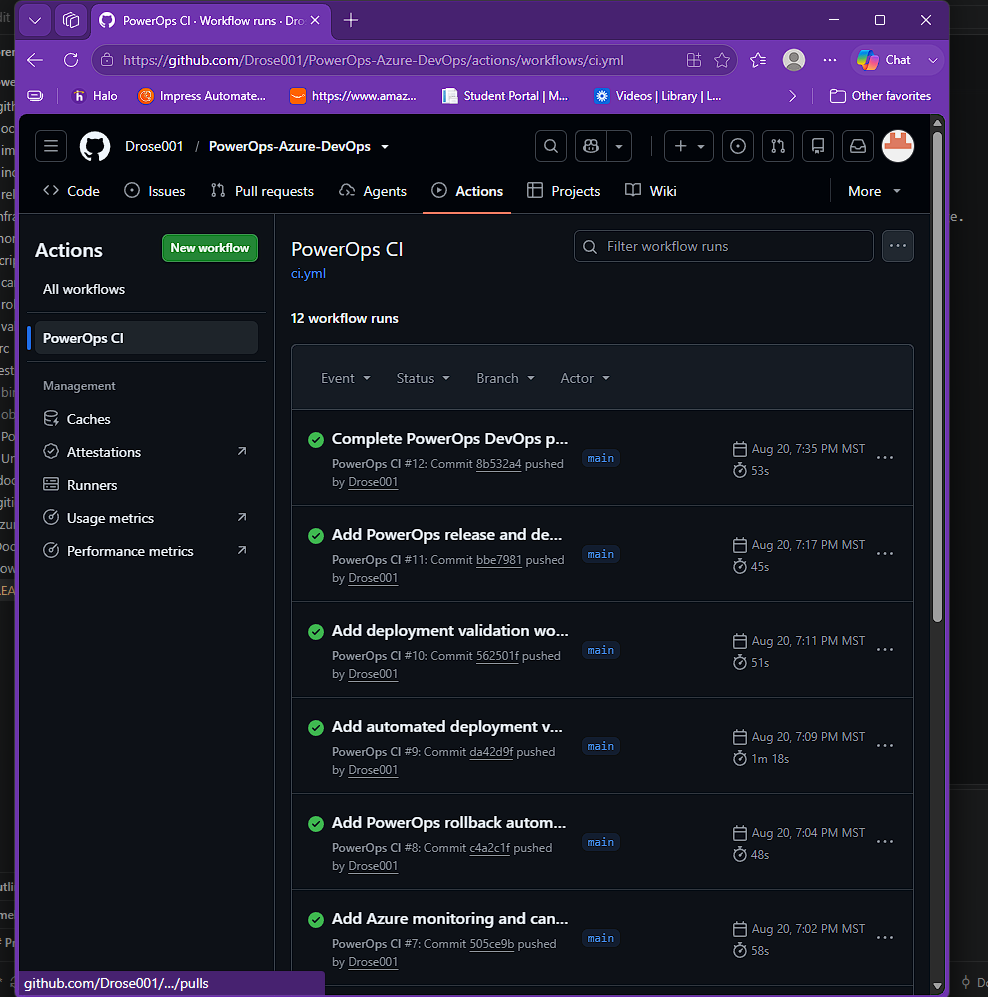
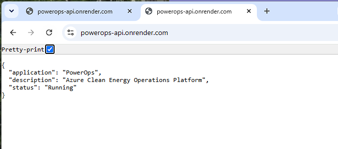
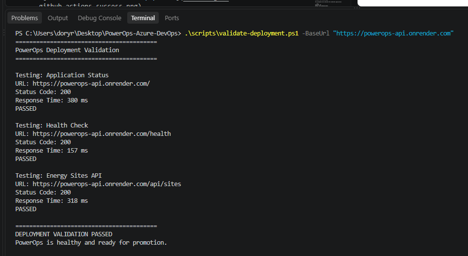
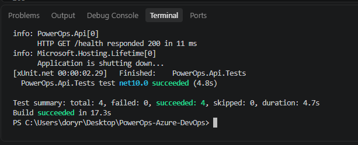
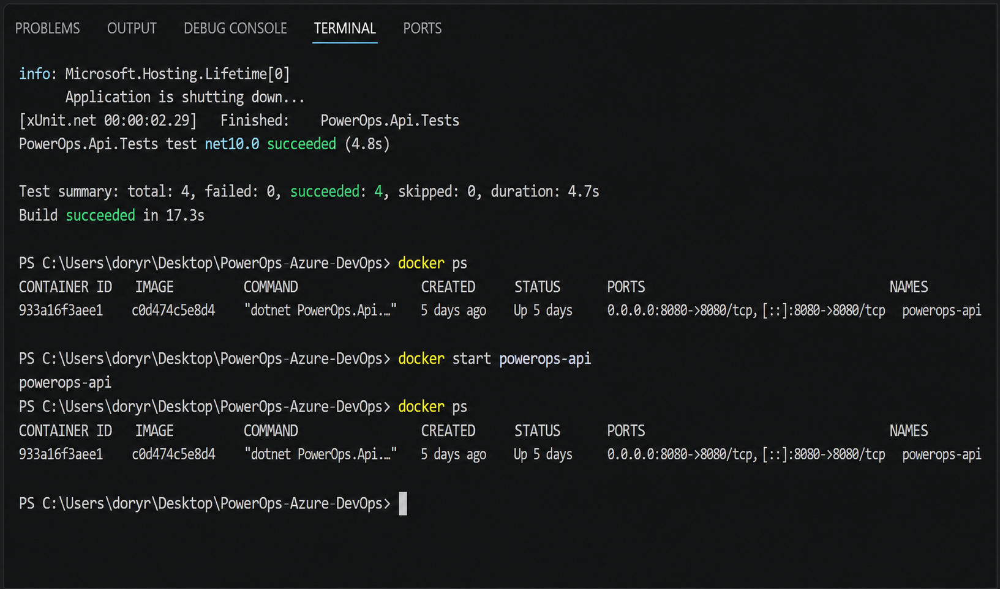
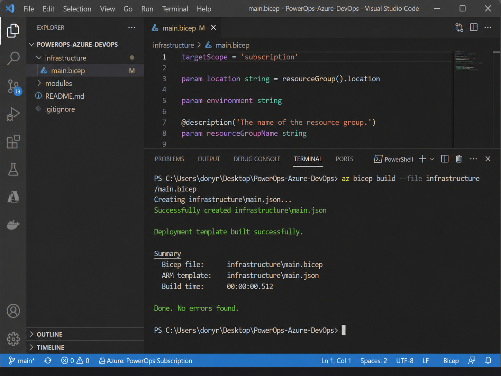
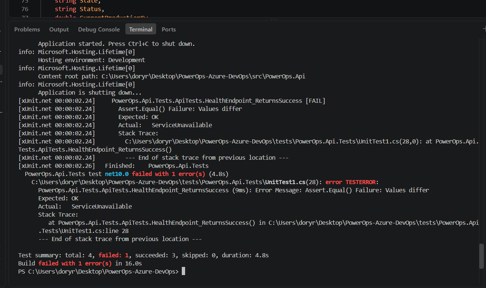

Verified Results

The following results were produced while building and testing PowerOps.

| Capability | Verified Result | Implementation |
|---|---|---|
| Live Deployment | ✅ Public API running | Render + Docker |
| CI Pipeline | ✅ Successful | GitHub Actions |
| Automated Tests | ✅ 4/4 passing | xUnit / .NET |
| Docker Build | ✅ Successful | Docker |
| Health Check | ✅ HTTP 200 | `/health` |
| Deployment Validation | ✅ Passed | PowerShell |
| Structured Logging | ✅ Working | ASP.NET Core |
| Bicep Compilation | ✅ Successful | Azure Bicep |
| Failure Detection | ✅ HTTP 503 caught | Automated tests |
| Rollback Automation | ✅ Script implemented | PowerShell |
| Canary Automation | ✅ Script implemented | PowerShell |

---

CI/CD Evidence

PowerOps uses GitHub Actions to automatically build, test, and validate the Docker image.



The successful workflow verifies:

- .NET dependency restore
- Application build
- Automated integration tests
- Docker image build

Workflow definition:

```text
.github/workflows/ci.yml
```

---

## Live Deployment Evidence

PowerOps is running publicly as a Docker container on Render.

**Live API:** https://powerops-api.onrender.com



Verified endpoints:

```text
GET /
GET /health
GET /api/sites
```

---

## Deployment Validation Evidence

PowerOps includes an automated post-deployment validation script.



Actual validation result:

```text
Application Status
Status Code: 200
PASSED

Health Check
Status Code: 200
PASSED

Energy Sites API
Status Code: 200
PASSED

DEPLOYMENT VALIDATION PASSED
PowerOps is healthy and ready for promotion.
```

Script:

```text
scripts/validate-deployment.ps1
```

---

## Automated Testing Evidence

PowerOps uses automated integration tests to validate API behavior.



Healthy build:

```text
Total tests: 4
Succeeded: 4
Failed: 0
```

Tests are located in:

```text
tests/PowerOps.Api.Tests
```

---

## Docker Evidence

PowerOps is packaged and executed as a Docker container.



The container exposes:

```text
8080
```

and serves the PowerOps API from the same container image used for deployment.

---

## Infrastructure as Code Evidence

Azure infrastructure is modeled using Bicep.



The following command successfully validates the infrastructure template:

```powershell
az bicep build --file infrastructure/main.bicep
```

The Bicep architecture models:

- Azure Container Registry
- Azure Container Apps
- Managed Identity
- RBAC
- Azure Key Vault
- Log Analytics
- Azure Monitor alerts
- Health probes
- Autoscaling

> These Azure resources are currently modeled in Infrastructure as Code and are not deployed to an Azure subscription.

---

## Incident Detection Evidence

PowerOps includes a controlled failure simulation.

The `/health` endpoint was intentionally changed from HTTP `200` to HTTP `503`.



The automated test detected the unhealthy application:

```text
Expected: OK
Actual: ServiceUnavailable

Total tests: 4
Succeeded: 3
Failed: 1
```

After correcting the problem:

```text
Total tests: 4
Succeeded: 4
Failed: 0
```

Full incident documentation:

```text
docs/incident-001.md
```
## Live Demo

PowerOps is currently deployed as a Docker container on Render.

**Live API**

https://powerops-api.onrender.com

### Public Endpoints

| Endpoint | Purpose |
|---|---|
| `/` | Application status |
| `/health` | Deployment and service health |
| `/api/sites` | Simulated energy facilities |
| `/api/sites/{id}` | Individual facility |
| `/api/sites/{id}/production` | Facility production data |

Examples:

```text
https://powerops-api.onrender.com/
https://powerops-api.onrender.com/health
https://powerops-api.onrender.com/api/sites

